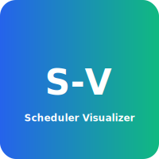

# CPU Scheduling Visualizer

<p align="center">
  
</p>

<p align="center">
  
  
  
</p>

This project is a web-based visualizer for CPU scheduling algorithms, specifically Round Robin and Shortest Remaining Time First (SRTF). It allows users to input process arrival and burst times, select an algorithm, and view the resulting Gantt chart, CPU utilization, and process statistics.

## Features
- **Round Robin and SRTF algorithms**
- Dynamic Gantt chart visualization
- CPU utilization calculation
- Table of process statistics (Finish, Turnaround, Waiting times)
- Responsive UI
- Quantum input is shown/hidden based on algorithm selection

## Usage
1. Enter arrival and burst times (space-separated).
2. Select the scheduling algorithm.
3. For Round Robin, enter the time quantum.
4. Click **Solve** to view results.
5. Click **Clear** to reset inputs and outputs.

## How to Run Locally
1. Clone the repository:
   ```
   git clone https://github.com/<your-username>/<repo-name>.git
   ```
2. Open `index.html` in your browser.

## Deploying to GitHub Pages
- Push your code to a GitHub repository.
- Enable GitHub Pages in the repository settings.
- Visit your site at `https://<your-username>.github.io/<repo-name>/`.

## Files
- `index.html` — Main HTML and UI
- `script.js` — Scheduling logic and interactivity

## **Styles**

- **Include**: The project uses an external stylesheet `style.css`. Make sure the link tag in `index.html` points to it:

```html
<link rel="stylesheet" href="style.css" />
```

- **Layout & Responsiveness**: The CSS centers the main content, uses a responsive grid for desktop vs mobile, and keeps elements readable on small screens. Key classes:
  - `.wrap`: page container with a two-column grid on wide screens and a single column on small screens.
  - `.main`, `.card`: center content and provide consistent padding and card styling.

- **Gantt chart handling**: Long Gantt charts are wrapped so they don't force full-page horizontal scrolling:
  - `.gantt-container` provides `overflow-x: auto` and centers the chart.
  - The `#gantt` element has a `min-width` so the chart remains usable on narrow screens.

- **Typography & controls**: Inputs, selects, buttons, and table text sizes were increased for legibility:
  - Base font-size is larger (`body { font-size: 18px; }`) with a mobile fallback at smaller viewports.
  - Inputs and buttons use slightly larger font sizes and padding for touch friendliness.

- **Sample important rules** (excerpt from `style.css`):

```css
.gantt-container {
  width: 100%;
  max-width: 100vw;
  overflow-x: auto;
  display: flex;
  justify-content: center;
  align-items: center;
  margin: 24px 0 8px 0;
  padding-bottom: 8px;
}

#gantt { min-width: 320px; margin: 0 auto; }

body { font-size: 18px; }

input, button, select { font-size: 1.08rem; }
```

If you want the README to display the entire `style.css` file (complete stylesheet) instead of the summary above, tell me and I will append the full CSS content or link to it directly in the README.

## **Logo CSS**

To keep the project logo neat and responsive in the README and on the site, use a small CSS snippet. You can either add this to your `style.css` (for the live site) or use the inline example below for documentation:

```css
.project-logo {
  display: block;          /* centers when paired with margin auto */
  width: 120px;            /* default desktop size */
  max-width: 28vw;         /* scale down on narrow viewports */
  height: auto;            /* preserve aspect ratio */
  margin: 0 auto 8px;      /* center and add a little spacing */
}

@media (max-width: 420px) {
  .project-logo { width: 88px; }
}
```

Usage in HTML (README or `index.html`):

```html

```

Notes:
- GitHub renders local SVG files in the README, so the `logo.svg` file will show on GitHub automatically.
- For the live site, include the CSS rule in `style.css` (or a small inline `<style>` block) so the logo scales consistently with the rest of your layout.

## License
MIT
